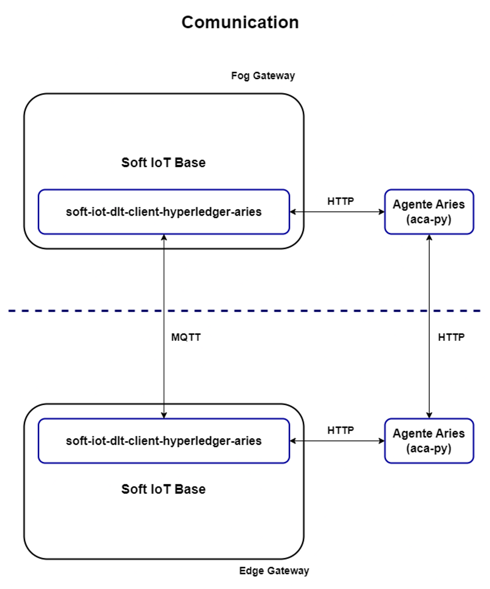

# soft-iot-dlt-client-hyperledger-aries

O `soft-iot-dlt-client-hyperledger-aries` é o _bundle_ genérico que tem como objetivo oferecer identidades descentralizadas para os nós da rede SOFT-IoT por meio da comunicação HTTP com agentes Aries (aca-py). Isso permite uma gestão segura e autônoma das identidades dos nós, possibilitando interações confiáveis entre eles.

## Visão Geral

Este _bundle_ integra a capacidade de prover identidade auto-soberana à Plataforma SOFT-IoT. A abordagem baseada em identidade auto-soberana permite que os nós da rede mantenham controle total sobre suas identidades, compartilhando apenas as informações estritamente necessárias durante as interações.

O agente **Aries (aca-py)**, desenvolvido pela Hyperledger, é utilizado como base para as interações de identidade. Ele fornece os recursos necessários para configurar, gerenciar e trocar identidades de forma segura e verificável.

## Arquitetura

  

## Funcionalidades Principais

As seções seguintes apresentam as funcionalidades que o _bundle_ oferece por meio de solicitações HTTP aos agentes Aries (aca-py):

### 1. Definição de Credencial

Permite a definição de configurações para credenciais verificáveis, especificando os detalhes do emissor, esquema e definições de revogação.

A partir do momento em que o _bundle_ iniciar, é enviada uma solicitação HTTP para o Agent Aries com objetivo de criar a definição de credencial e armazená-la na _blockchain_.

| Propriedades da Definição de Credencial | Valor padrão  |
| --------------------------------------- | ------------- |
| name                                    | soft-iot-base |
| version                                 | 1.0           |

| Atributos | Descrição                  |
| --------- | -------------------------- |
| idNode    | Identificador do nó |

---

### 2. Conexão entre Agentes

- #### Geração de convite de conexão

  Gera um convite para estabelecer uma conexão confiável entre os nós da rede. Esse convite contém informações para iniciar o processo de troca de chaves e estabelecer um canal seguro de comunicação.

- #### Recebimento de convite de conexão

  Permite que um nó aceite um convite de conexão recebido, estabelecendo assim uma relação confiável com outro participante.

Assim que um _edge gateway_ inicia, envia uma solicitação HTTP para o _Agent Aries_ a fim de receber um convite de conexão gerado por esse agente. A partir disto, o _edge gateway_ envia o convite para o _fog gateway_ para o mesmo aceitar no seu próprio agente.

---

### 3. Criação de Credencial Verificável

Define uma estrutura para uma nova credencial verificável, especificando os atributos e valores a serem incluídos.

No momento do envio de convite de conexão, o _edge gateway_ envia também o seu endereço IP. Com esta informação, o _fog gateway_ pode criar uma credencial onde o valor do `idNode` será o endereço IP recebido.

---

### 4. Emissão de Credencial Verificável

Realiza a emissão de uma nova credencial verificável para um agente específico.

O _fog gateway_ envia uma solicitação HTTP para o Agent Aries com objetivo do mesmo emitir uma credencial para um agente de um _edge gateway_.

---

### 5. Solicitação de Prova de Credencial Verificável

Inicia uma solicitação de prova da validade de uma credencial verificável específica.

O _fog gateway_ envia uma solicitação HTTP para o Agent Aries com objetivo do mesmo fazer um solicitação de prova de credencial para o agente de um _edge gateway_ que acabou de se conectar.

---

### 6. Envio de Apresentação de Credencial Verificável

Envia uma apresentação de uma credencial verificável como comprovação de que o nó possui permissão para interagir no ambiente.

O _edge gateway_ envia uma solicitação HTTP para o Agent Aries com objetivo do mesmo enviar uma apresentação de credencial para o agente de um _fog gateway_ que solicitou a comprovação da mesma.

---

## Ledger VON NETWORK

O projeto utiliza o ledger VON NETWORK para registrar e verificar as credenciais verificáveis emitidas. O VON NETWORK é um ledger baseado em blockchain que fornece uma base confiável para o armazenamento e a verificação de identidades descentralizadas.

## Armazenamento de Credenciais

Cada nó da rede possui sua própria carteira, implementada utilizando um banco de dados PostgreSQL. Isso permite que as credenciais verificáveis sejam armazenadas de forma segura e acessível para uso posterior.

## Integração com ngrok

Para fornecer os serviços dos agentes aca-py na internet, este projeto utiliza o ngrok, permitindo que os nós da rede possam interagir com os agentes por meio de URLs acessíveis publicamente.

## Licença

Este projeto é licenciado sob a Licença MIT - consulte o arquivo [LICENSE](LICENSE) para obter mais detalhes.
